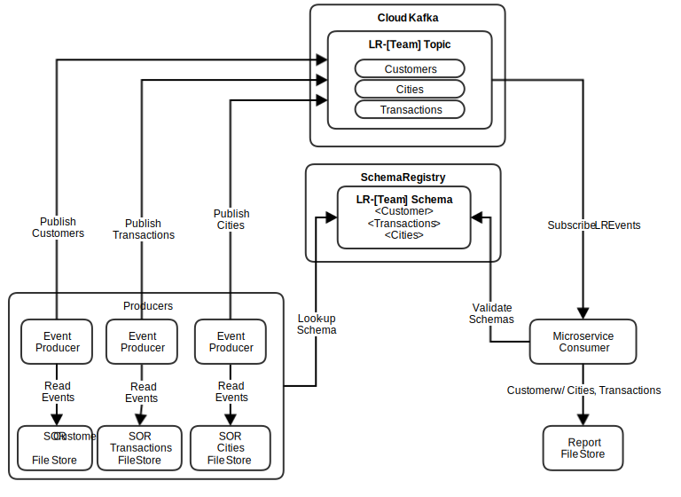

# Zeus Cloud Team
## Kafka Bootcamp 2017
---
### Preparing for the bootcamp
The bootcamp will start off with an introductory talk about Kafka which will describe the 4 scenarios included in the bootcamp and then launch into a session of hands on development.  People will be asked to form 4 - 6 person groups.  Groups can collaborate and work on the scenarios together.

#### Environment
The bootcamp will be done on your personal laptop, connecting to an instance of Confluent Cloud (Apache Kafka hosted on AWS).  There is starter code to get you going.  The starter code is a [starter producer](https://github.com/Zeus-Cloud-Team/kafka-producer-starter), [starter consumer](https://github.com/Zeus-Cloud-Team/kafka-consumer-starter) and [instructions to set up the Confluent Cloud CLI tool](https://github.com/Zeus-Cloud-Team/confluent-cloud-cli) for administering your topics on Confluent Cloud (called ccloud cli).

#### Preparing your laptop
1. [Make sure your laptop has a JDK more recent than 1.8.0_101](http://www.oracle.com/technetwork/java/javase/downloads/jdk8-downloads-2133151.html) , without at least this version you won't be able to connect to Confluent Cloud.  In addition to this version being installed it should also be the active java runtime for your maven (see step 3) and your IDE (see step 2)
2. Your laptop should have your favorite IDE for java development (Intellij, Eclipse, Netbeans)
3. Have command line maven [installed](https://maven.apache.org/download.cgi) and available for use on the command line.
1. Alternatively, you could [install and run Kafka locally](https://www.confluent.io/download/) and use that during the bootcamp as long as you're not using windows, there's nothing special about Confluent Cloud Kafka that you can't get by running locally.

#### Setup Confluent Cloud
1. Get connection details and credentials from the Cloud team (bootstrap servers list, schema registry server, api key(username), api secret(password)).  [Boostrap and registry servers](https://github.com/Zeus-Cloud-Team/kafka-bootcamp-instructions/blob/master/connection-info.yml).  API key and username will be provided during Hackathon or email the adoption team if you want to get started early.
2. [Install ccloud](https://github.com/Zeus-Cloud-Team/confluent-cloud-cli), you'll need the information from step 1 to connect ccloud cli to the instance of Confluent Cloud we're using.  Once you connect familiarize yourself with administration of topics.
3. You will have to follow these guidelines when using ccloud cli to administer Confluent Cloud Kafka
   * If part of a team select one person from the team and use that persons first name to prefix all topics you interact with
   * NEVER modify a topic that you do not own, or are not working on as part of a team
**NOTE** There is only 1 account, so all participants will have the ability to modify every other topic.  Like Uncle Ben said, with great power comes great responsibility.

#### Preparing your brain
This bootcamp is targeted for people who are familiar with Kafka.  Coming into this event you should be armed with knowledge.

1. [Kafka - The Definitive Guide](https://www.confluent.io/wp-content/uploads/confluent-kafka-definitive-guide-complete.pdf)
2. [You should know about Avro and schemas](https://www.confluent.io/blog/avro-kafka-data/)
2. Reach out to the Cloud team to get more recommended reading material to prepare yourself
1. [Download Kafka to run locally](https://www.confluent.io/download/) if you are on a non windows machine (don't try to run Kafka on windows), and try out the scenarios listed here.
5. Review the [bootcamp starter code](https://github.com/Zeus-Cloud-Team), clone it, build it, run it **but make sure you use your own topics to run it against**

#### Is there any sample code I can start off with?
1. Yes you can start off with the Kafka Bootcamp starter code
    * [Starter producer code](https://github.com/Zeus-Cloud-Team/kafka-producer-starter)
      * Contains the 3 data files in its /resources/data folder
      * will connect to a on
    * [Starter consumer code](https://github.com/Zeus-Cloud-Team/kafka-consumer-starter)
2. During the bootcamp talk to your team and agree on a naming prefix for your teams topics (ie lojo-topicnames where 'lojo' is the team name)
1. Use ccloud cli to create the required topics
1. git clone the producer code
  1. update its properties to include username and password (to be provided to you by cloud team) and a value for a local writable.dir
  1. update the property value for topic name and group id to use your own topic and consumer groups (consumer groups get auto created so no need to pre-create them, but topics have to be created beforehand with ccloud cli)
2. run it either from your IDE or from command line (see howToRun.sh for more details)
3. the producer codebase has the 3 files used in the bootcamp in its local /resources/data dir, when you run the code it will convert each row of each file to an avro message and publish it to the topic defined
4. apply the same changes to the consumer starter code and run it, you should see the same messages that are being produced getting consumed.  The consumer starter code base only comes with a listener for the transactions topic.
1. These are starter code repos that're meant to be extended so make it your own and use it as a tool to help solve the use cases described below

## The scenarios
### 1 - Event Sourcing

**When would I use this pattern?**

A new microservice (or external data source) is released and needs to be synchronized with a system-of-record in real-time.

**Materials Provided:**
* 3 Files with system-of-record (SOR) data (customer, city, transaction data)
* Kafka
* Kafka Schema Registry

**Each team will need to develop the following:**
1. Avro schema defining each of the 3 files
1. Topic(s) on Kafka to publish/consume the data to/from (Topic naming should follow this naming structure (Team)-(dataset), for example lojo-transactions and lojo-customers where 'lojo' is the team name and 'transactions' and 'customers' are the dataset name
1. Event Producers microservices that read the system-of-record data (from files and publish to topic(s) on Kafka).  Use ccloud cli to create topics required (in order to simulate events, have the process sleep for a second or so in between pubishing each message)
1. Consumer microservices that read the topics and consume the messages in real time and flush the results out to files.
1. The consumer(s) and producer(s) use Avro format to send the data in, and the Avro schemas are being tracked with the schema registry

**This scenario is finished when**
* Data from the 3 source files are being published via Avro and being captured and saved in 3 different files in real time (ie data is stored as its available rather than just at the end when all data is available)

**Scenarios to consider**
* Day-Zero Load - The microservice store must be initialized for the first time with a current state of the SOR store.
* Real-time Updates - The microservice store must continuously updated with a current updates of the SOR store.
* Bonus: Reconciliation - The SOR and microservice stores must be reconciled.

### 2 - Business Rules

**When would I use this pattern?**

A series of business rules must be applied in order to a series of data sets. Each rule is applied in sequence

**Materials Provided:**

Same as scenario 1

**Each team will need to develop the following:**
* appropriate schema and topics
* appropriate producer(s)
* Avro schema usage
* Consumer microservice(s) that consume the published data
  * somewhere here the data will need to be filtered (only keep transactions >= $1000)
  * and then aggregation will need to be applied (for each customer show the last 30 seconds average transaction)
  * the filtered data should be published to a new topic in avro format
  * the aggregated data should be published to a new topic in avro format

**Scenarios**
* Business Rule Order - Filtering must occur before aggregation
* Filtering - The filter rule selects all transactions greater than 1000 CAD and publishes result to topic.
* Aggregation / Windowing - The aggregation rule provides a count, a total sum, an average sum of customer transactions over a 30-second hopping windows and publishes to a topic

**This scenario is finished when**
* Data from 3 source files are flowing into the consumer(s) which applies filtering and aggregation and is publishing those results back to topic(s) in real time

### 3 - Live Reports

**When would I use this pattern?**
A live report of the current data streams produced in real-time.

**Materials provided:**

Same as scenario's 1 and 2

**Each team will need to develop the following**
* appropriate schema and topics
* appropriate producer(s)
* Avro schema usage
* consumer microservice joins the different streams of datasets
  * consumer produces a report that shows transactions along with the first and last name of the customer making the transaction
  * use kafka ktables and ksql to join customer and transactions

**Scenarios**
* Stream enrichment - Join two streams of data that are flowing in
* KSQL - this is using a new technology from Confluent, although you could achieve the result but using java and data structures, bonus points to you if you can achieve this using ktables and ksql

